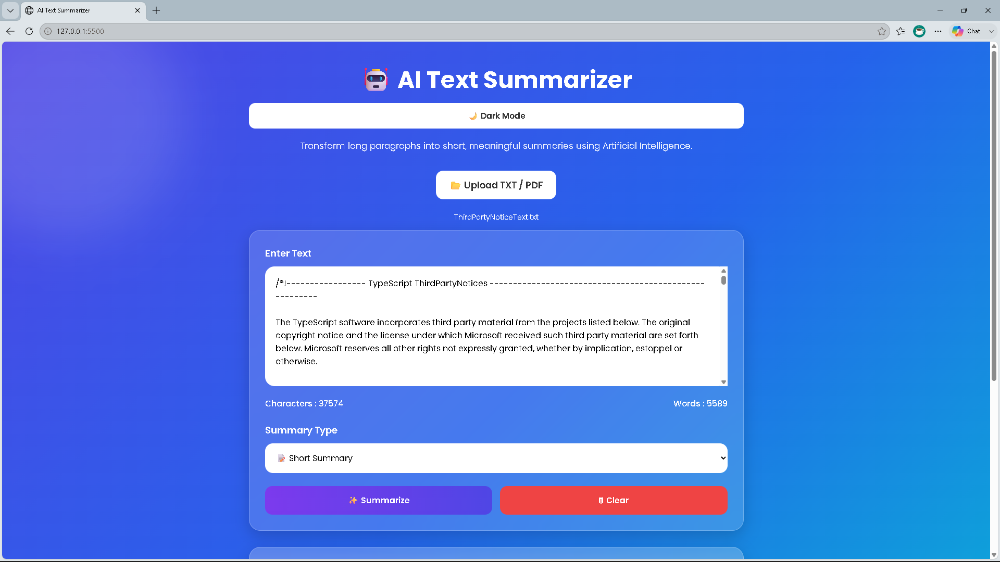
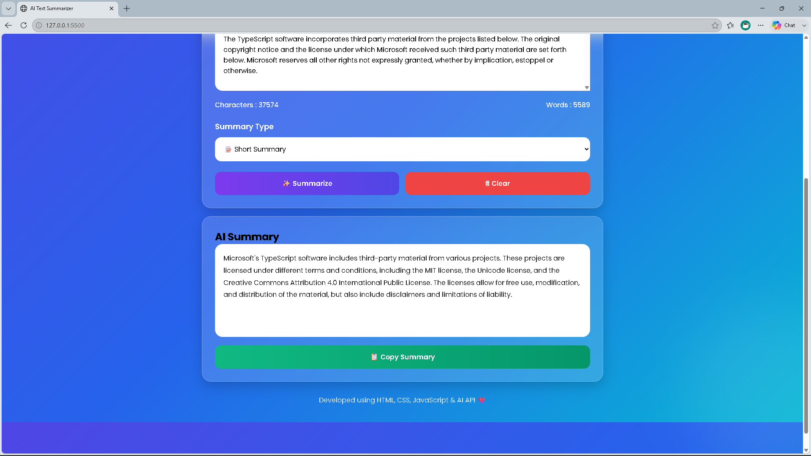

# 🤖 AI Text Summarizer

An AI-powered web application that summarizes long text into concise and meaningful summaries using the Hugging Face AI API.

## 🚀 Features

- AI Text Summarization
- Short Summary
- Bullet Summary
- Professional Summary
- Explain Like I'm 10
- Key Points
- PDF Upload
- TXT Upload
- Character Count
- Word Count
- Dark Mode
- Responsive Design
- Copy Summary

## 🛠️ Technologies Used

- HTML5
- CSS3
- JavaScript (ES6)
- Hugging Face Inference API
- PDF.js

## 📸 Screenshots

### Home Page

### AI Generated Summary

## 👨‍💻 Author

Sripriyan S